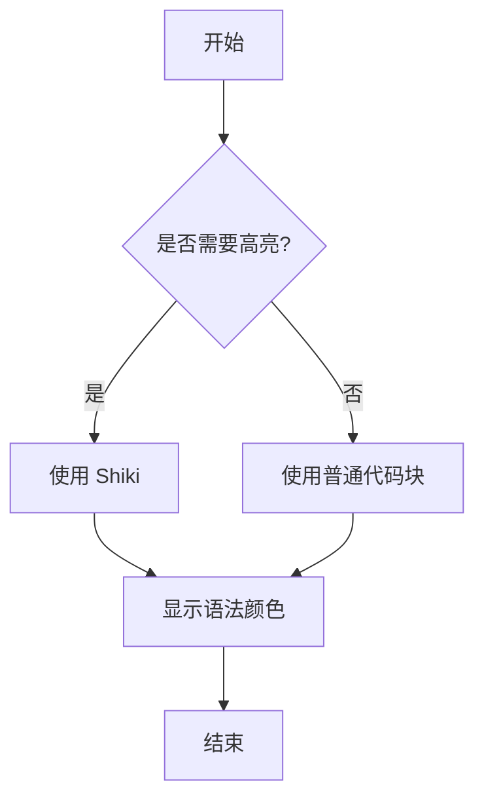
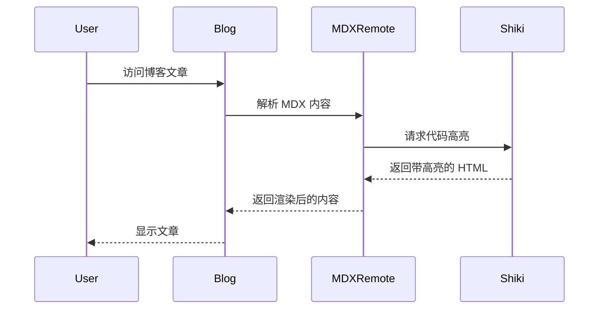
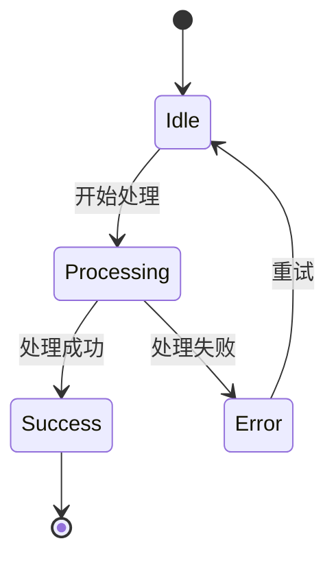
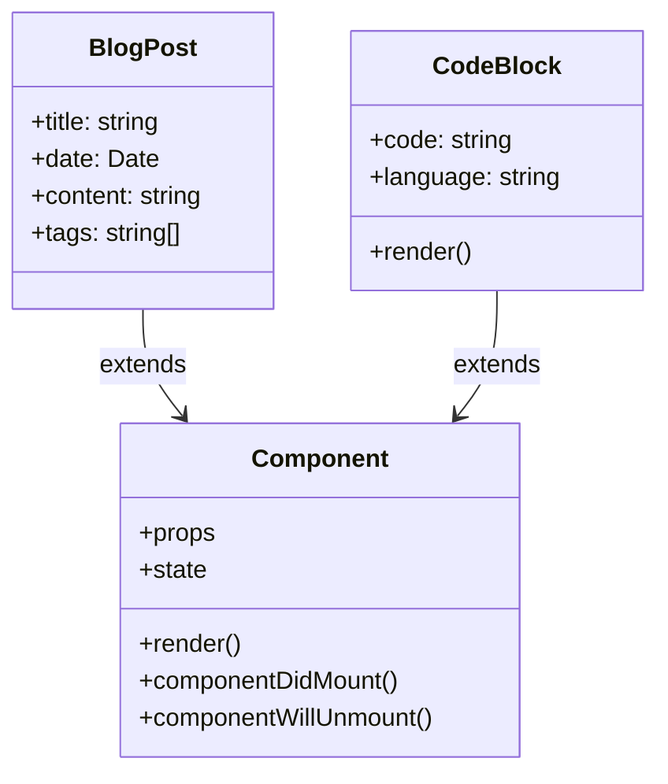

本文用于测试博客的代码语法高亮和 Mermaid 图表功能。

## JavaScript/TypeScript 代码高亮

```javascript
// 示例：React 组件
import { useState, useEffect } from 'react'

function Counter({ initialCount = 0 }) {
  const [count, setCount] = useState(initialCount)

  useEffect(() => {
    document.title = `Count: ${count}`
  }, [count])

  return (
    <div>
      <p>Count: {count}</p>
      <button onClick={() => setCount(count + 1)}>Increment</button>
    </div>
  )
}
```

## Python 代码高亮

```python
# 示例：斐波那契数列
def fibonacci(n):
    if n <= 1:
        return n
    return fibonacci(n - 1) + fibonacci(n - 2)

# 计算前 10 个斐波那契数
fib_sequence = [fibonacci(i) for i in range(10)]
print(fib_sequence)
```

## TypeScript 类型定义

```typescript
interface User {
  id: string
  name: string
  email: string
  createdAt: Date
}

type UserRole = 'admin' | 'editor' | 'viewer'

interface ExtendedUser extends User {
  role: UserRole
  permissions: string[]
}
```

## Mermaid 流程图



## Mermaid 时序图



## Mermaid 状态图



## Mermaid 类图


